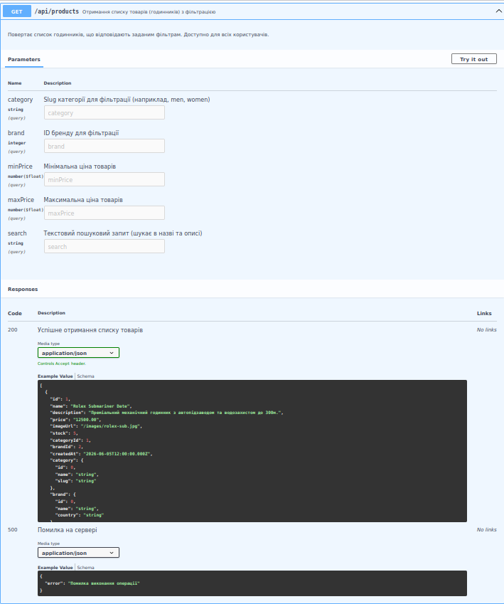
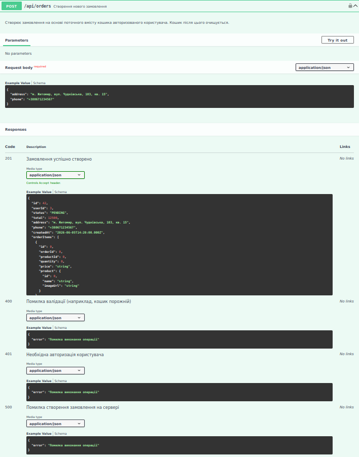

# Інтернет-магазин дизайнерських годинників

## Документація проекту 📄

Для проекту підготовлено технічну та бізнес-документацію, а також специфікацію API.

### 📂 Розташування файлів у репозиторії:
* **Business Requirements Document (BRD)** (опис бізнес-вимог, цілей та функціоналу) - [BRD.md](./BRD.md)
* **System Specification Document (SSD)** (системна специфікація, архітектура та схема БД) - [SSD.md](./SSD.md)

---

### 🌐 Інтерактивна документація API (Swagger UI)
Інтерактивний інтерфейс Swagger UI доступний локально після запуску проекту:
👉 **[http://localhost:3000/api-doc](http://localhost:3000/api-doc)**

<details>
<summary>📸 Скріншоти інтерфейсу Swagger UI (натисніть, щоб розгорнути)</summary>




</details>

---


## Стек технологій
- Next.js 16 (App Router)
- TypeScript
- Prisma ORM
- PostgreSQL
- NextAuth.js
- Docker / Docker Compose

## Запуск

```bash
cd project
docker compose up --build
```


